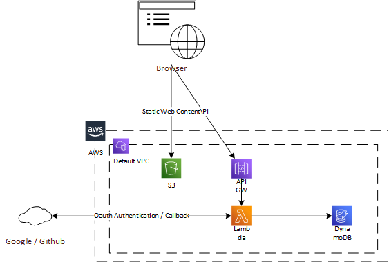
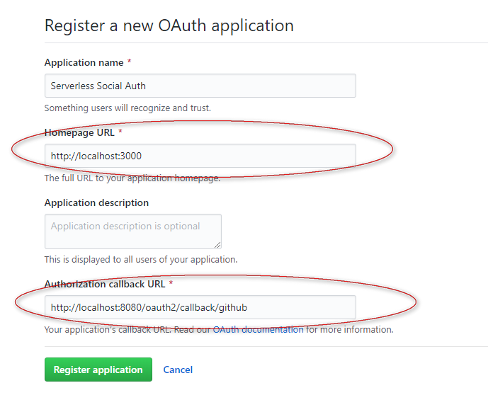
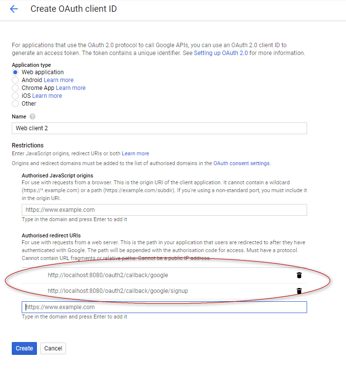
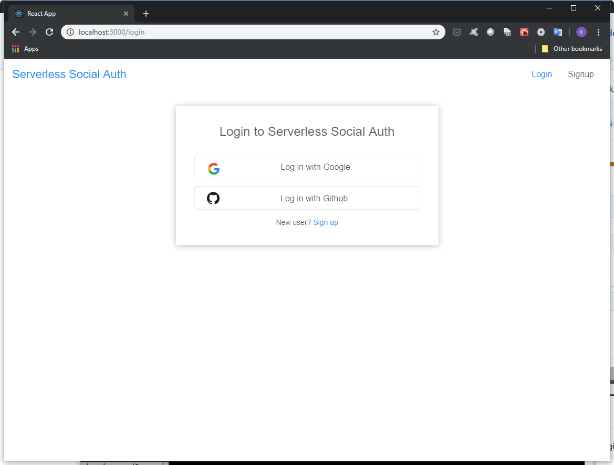

# Serverless OAuth2 Social Login Demo

This application demostrates OAuth2 Social Login using serverless framework and nodejs.  The final target environment will be run on AWS with following architecture :
* Frontend react app hosted on S3 bucket
* Backend application (OAuth2 client) runs on Lambda with Nodejs
* Dynamodb as database

Architecture Diagram :  
<p align="center">
  
</p>
<br/><br/>

Live Demo can be found in http://social-auth-frontend.s3-website-ap-southeast-1.amazonaws.com

## Step 1. Before deploying the application to AWS, first setup in desktop environment and perform testing

### Prerequisites
* NodeJS 8.1 or above
* Serverless Application Framework
  * npm install -g serverless
* Dynamodb Local
  * Follow the instructions in https://docs.aws.amazon.com/amazondynamodb/latest/developerguide/DynamoDBLocal.html
  * For docker version, run the following command
    * docker run -d -p 8000:8000 --rm -v ~/docker/dynamodb:/data amazon/dynamodb-local -jar DynamoDBLocal.jar -sharedDb -dbPath /data
    * The data file will be written to directory ~/docker/dynamodb.  If the docker host is in *nix, change the owner the directory to login user
  * Edit backend/.env file and update the IP address of __DYNAMODB_ENDPOINT__
  * Test connectivity to Dynamodb (Bold is code to execute, italic is expected output)
    <pre><code>
    <b>cd backend
    npm install
    cd dynamodb
    node createUserTable.js</b>
    
    <i>
    Created table. Table description JSON: {
        "TableDescription": {
        "AttributeDefinitions": [
          {
            "AttributeName": "email",
            "AttributeType": "S"
          },
          {
            "AttributeName": "id",
            "AttributeType": "S"
          }
        ],
        "TableName": "users",
        "KeySchema": [
          {
            "AttributeName": "email",
            "KeyType": "HASH"
          }
        ],
        "TableStatus": "ACTIVE",
        "CreationDateTime": "2019-04-21T05:12:39.078Z",
        "ProvisionedThroughput": {
          "LastIncreaseDateTime": "1970-01-01T00:00:00.000Z",
          "LastDecreaseDateTime": "1970-01-01T00:00:00.000Z",
          "NumberOfDecreasesToday": 0,
          "ReadCapacityUnits": 5,
          "WriteCapacityUnits": 5
        },
        "TableSizeBytes": 0,
        "ItemCount": 0,
        "TableArn": "arn:aws:dynamodb:ddblocal:000000000000:table\/users",
        "BillingModeSummary": {
          "BillingMode": "PROVISIONED",
          "LastUpdateToPayPerRequestDateTime": "1970-01-01T00:00:00.000Z"
        },
        "GlobalSecondaryIndexes": [
          {
            "IndexName": "id-index",
            "KeySchema": [
              {
                "AttributeName": "id",
                "KeyType": "HASH"
              }
            ],
            "Projection": {
              "ProjectionType": "ALL"
            },
            "IndexStatus": "ACTIVE",
            "ProvisionedThroughput": {
              "ReadCapacityUnits": 5,
              "WriteCapacityUnits": 5
            },
            "IndexSizeBytes": 0,
            "ItemCount": 0,
            "IndexArn": "arn:aws:dynamodb:ddblocal:000000000000:table\/users\/index\/id-index"
          }
        ]
      }
    }
    </i>  
    </code></pre>

* Setup Github OAuth application
  * Goto https://github.com/settings/developers
  * Click "New OAuth App"
  * Enter the following information  
    
  * Application name is arbitary, Homepage URL and Authorization callback URL must follow the above values
  * After registering the application, copy the __Client ID__ and __Client Secret__ 
  * Edit .env file and update the value of __OAUTH2_GITHUB_CLIENT_ID__ and __OAUTH2_GITHUB_CLIENT_SECRET__ from above
* Setup Google OAuth application
  * Goto https://console.developers.google.com/
  * Click "Create credentials" -> "OAuth client ID"
  * Enter the following information  
    
  * Name is arbitary, Authorised redirect URIs must follow the above values
  * After registering the application, copy the __Client ID__ and __Client Secret__ 
  * Edit .env file and update the value of __OAUTH2_GOOGLE_CLIENT_ID__ and __OAUTH2_GOOGLE_CLIENT_SECRET__ from above

<br/><br/>  
## Start the backend application
<pre><code><b>cd backend
npm install
npm run offline</b>

<i>Serverless: DOTENV: Loading environment variables from .env:
Serverless:      - STAGE
Serverless:      - DYNAMODB_ACCESS_KEY_ID
Serverless:      - DYNAMODB_SECRET_ACCESS_KEY
Serverless:      - DYNAMODB_REGION
Serverless:      - DYNAMODB_ENDPOINT
Serverless:      - OAUTH2_AUTHORIZED_REDIRECT_URI
Serverless:      - OAUTH2_AUTHORIZED_FAIL_REDIRECT_URI
Serverless:      - JWT_TOKEN_SECRET
Serverless:      - JWT_TOKEN_EXPIRATION_MSEC
Serverless:      - OAUTH2_GITHUB_CLIENT_ID
Serverless:      - OAUTH2_GITHUB_CLIENT_SECRET
Serverless:      - OAUTH2_GITHUB_CALLBACK_URL
Serverless:      - OAUTH2_GOOGLE_CLIENT_ID
Serverless:      - OAUTH2_GOOGLE_CLIENT_SECRET
Serverless:      - OAUTH2_GOOGLE_CALLBACK_URL
Serverless: Starting Offline: dev/ap-southeast-1.

Serverless: Routes for app:
Serverless: ANY /
Serverless: ANY /{proxy*}

Serverless: Offline listening on http://localhost:8080</i>
</code></pre>

## Start the frontend application
<pre><code><b>cd frontend
npm install
npm start</b>
</code></pre>
Open browser and goto ```http://localhost:3000```





## Step 2. Deploy backend application to AWS (and test with local frontend)
### Prerequisites
* Account signed-up in AWS
* Create AWS user for application access (https://docs.aws.amazon.com/IAM/latest/UserGuide/id_users_create.html#id_users_create_console), choose __Programmatic access__ and download the access id and key
* Create the file ~/.aws/credentials to store the AWS acccess id and key
  ```
  [serverless]
  aws_access_key_id = xxxxxx
  aws_secret_access_key = yyyyy
  ```
* Dynamodb on AWS
  * Edit backend/.env file and update the IP address of __DYNAMODB_ENDPOINT__ (Change the region)
  * Test connectivity to Dynamodb (Bold is code to execute, italic is expected output)
    <pre><code>
    <b>cd backend/dynamodb
    set NODE_ENV=prd     [Or export NODE_ENV=prd]
    node createUserTable.js</b>
    <i>
    NODE_ENV = prd
    Dynamo endpoint = https://dynamodb.ap-southeast-1.amazonaws.com
    Created table. Table description JSON: {
      "TableDescription": {
        "AttributeDefinitions": [
          {
            "AttributeName": "email",
            "AttributeType": "S"
          },
          {
            "AttributeName": "id",
            "AttributeType": "S"
          }
        ],
        "TableName": "users-prd",
        "KeySchema": [
          {
            "AttributeName": "email",
            "KeyType": "HASH"
          }
        ],
        "TableStatus": "CREATING",
        "CreationDateTime": "2019-04-27T02:22:37.595Z",
        "ProvisionedThroughput": {
          "NumberOfDecreasesToday": 0,
          "ReadCapacityUnits": 5,
          "WriteCapacityUnits": 5
        },
        "TableSizeBytes": 0,
        "ItemCount": 0,
        "TableArn": "arn:aws:dynamodb:ap-southeast-1:610433306035:table/users-prd",
        "TableId": "df9bc826-a6bc-4ace-9897-e1d578561285",
        "GlobalSecondaryIndexes": [
          {
            "IndexName": "id-index-prd",
            "KeySchema": [
              {
                "AttributeName": "id",
                "KeyType": "HASH"
              }
            ],
            "Projection": {
              "ProjectionType": "ALL"
            },
            "IndexStatus": "CREATING",
            "ProvisionedThroughput": {
              "NumberOfDecreasesToday": 0,
              "ReadCapacityUnits": 5,
              "WriteCapacityUnits": 5
            },
            "IndexSizeBytes": 0,
            "ItemCount": 0,
            "IndexArn": "arn:aws:dynamodb:ap-southeast-1:610433306035:table/users-prd/index/id-index-prd"
          }
        ]
      }
    }
    </i>  
    </code></pre>

* Setup Github OAuth application for prd environment
  * Goto https://github.com/settings/developers
  * Click "New OAuth App"
  * Enter the following information  
    
  * Application name is arbitary, Homepage URL and Authorization callback URL follow the above values (temporarily, need to update after deploying the backend application to AWS)
  * After registering the application, copy the __Client ID__ and __Client Secret__ 
  * Edit __.env.prd__ file and update the value of __OAUTH2_GITHUB_CLIENT_ID__ and __OAUTH2_GITHUB_CLIENT_SECRET__ from above
* Setup Google OAuth application for prd environment
  * Goto https://console.developers.google.com/
  * Click "Create credentials" -> "OAuth client ID"
  * Enter the following information  
    
  * Name is arbitary, Authorised redirect URIs follow the above values (temporarily, need to update after deploying the backend application to AWS)
  * After registering the application, copy the __Client ID__ and __Client Secret__ 
  * Edit __.env.prd__ file and update the value of __OAUTH2_GOOGLE_CLIENT_ID__ and __OAUTH2_GOOGLE_CLIENT_SECRET__ from above

<br/>
Deploy backend application to AWS
<pre><code><b>cd backend
npm install
npm run staging</b>

<i>> cross-env NODE_ENV=prd sls deploy

Serverless: DOTENV: Loading environment variables from .env.prd:
Serverless:      - STAGE
Serverless:      - DYNAMODB_REGION
Serverless:      - DYNAMODB_ENDPOINT
Serverless:      - OAUTH2_AUTHORIZED_REDIRECT_URI
Serverless:      - OAUTH2_AUTHORIZED_FAIL_REDIRECT_URI
Serverless:      - JWT_TOKEN_SECRET
Serverless:      - JWT_TOKEN_EXPIRATION_MSEC
Serverless:      - OAUTH2_GITHUB_CLIENT_ID
Serverless:      - OAUTH2_GITHUB_CLIENT_SECRET
Serverless:      - OAUTH2_GITHUB_CALLBACK_URL
Serverless:      - OAUTH2_GOOGLE_CLIENT_ID
Serverless:      - OAUTH2_GOOGLE_CLIENT_SECRET
Serverless:      - OAUTH2_GOOGLE_CALLBACK_URL
Serverless: Packaging service...
Serverless: Excluding development dependencies...
Serverless: Creating Stack...
Serverless: Checking Stack create progress...
.....
Serverless: Stack create finished...
Serverless: Uploading CloudFormation file to S3...
Serverless: Uploading artifacts...
Serverless: Uploading service social-auth-backend.zip file to S3 (8.54 MB)...
Serverless: Validating template...
Serverless: Updating Stack...
Serverless: Checking Stack update progress...
.......................................
Serverless: Stack update finished...
Service Information
service: social-auth-backend
stage: prd
region: ap-southeast-1
stack: social-auth-backend-prd
resources: 13
api keys:
  None
endpoints:
  ANY - https://76fpb754rd.execute-api.ap-southeast-1.amazonaws.com/prd/
  ANY - https://76fpb754rd.execute-api.ap-southeast-1.amazonaws.com/prd/{proxy+}
functions:
  app: social-auth-backend-prd-app
layers:
  None</i>
</code></pre>

* Update Github OAuth application for prd environment
  * Replace the base URL in Authorization callback URL by the endpoint returned in above
  * E.g, Change ```http://localhost:8080/oauth2/callback/github``` to ```https://76fpb754rd.execute-api.ap-southeast-1.amazonaws.com/prd/oauth2/callback/github```

* Update Google OAuth application for prd environment
  * Replace the base URL in Authorised redirect URIs by the endpoint returned in above
  * E.g, Change ```http://localhost:8080/oauth2/callback/google``` to ```https://76fpb754rd.execute-api.ap-southeast-1.amazonaws.com/prd/oauth2/callback/google```
  * Change ```http://localhost:8080/oauth2/callback/google/signup``` to ```https://76fpb754rd.execute-api.ap-southeast-1.amazonaws.com/prd/oauth2/callback/google/signup```

## Test with local frontend application
* Edit the file frontend/.env.development and change the value of __REACT_APP_API_BASE_URL__ to the endpoint returned in backend application deployment
* E.g, Change ```http://localhost:8080``` to ```https://76fpb754rd.execute-api.ap-southeast-1.amazonaws.com/prd```
<pre><code><b>cd frontend
npm install
npm start</b>
</code></pre>
Open browser and goto ```http://localhost:3000```, test signup with user to see if new user can be registered 
<br/><br/>


## Step 3. Deploy frontend application to AWS
* Deploy react app to AWS bucket as public website
  * Edit frontend/.env.production file and update the value of __REACT_APP_API_BASE_URL__ to the value of endpoint returned in backend application deployment
  * Edit the file frontend/.serverless.yml
    * Change the value of custom->bucketName so it does not conflict with other (bucket name in AWS has to be globally unique in all regions)  
  * Deploy the react app to S3 bucket (Bold is code to execute, italic is expected output)
    <pre><code>
    <b>cd front
    npm run deploy</b>
    <i>
    Serverless: Packaging service...
    Serverless: Creating Stack...
    Serverless: Checking Stack create progress...
    .....
    Serverless: Stack create finished...
    Serverless: Uploading CloudFormation file to S3...
    Serverless: Uploading artifacts...
    Serverless: Validating template...
    Serverless: Updating Stack...
    Serverless: Checking Stack update progress...
    ......
    Serverless: Stack update finished...
    Service Information
    service: social-auth-frontend
    stage: prd
    region: ap-southeast-1
    stack: social-auth-frontend-prd
    resources: 2
    api keys:
      None
    endpoints:
      None
    functions:
      None
    layers:
      None
    S3 Sync: Syncing directories and S3 prefixes...
    ......
    S3 Sync: Synced.
    </i>  
    </code></pre>
  * For subsequent redeployment, it may require to delete the CloudFormation stack __social-auth-frontend-prd__
  * Edit the file backend/.env.prd, and update the base URL of __OAUTH2_AUTHORIZED_REDIRECT_URI__ and __OAUTH2_AUTHORIZED_REDIRECT_URI__ from ```http://localhost:3000``` to ```http://<bucket-name>.s3-website-<AWS-region>.amazonaws.com```, e.g. ```http://social-auth-frontend.s3-website-ap-southeast-1.amazonaws.com```
  * Redeploy the backend application again

Open browser and goto ```http://<bucket-name>.s3-website-<AWS-region>.amazonaws.com```, e.g. ```http://social-auth-frontend.s3-website-ap-southeast-1.amazonaws.com```, test signup with user to see if new user can be registered 
